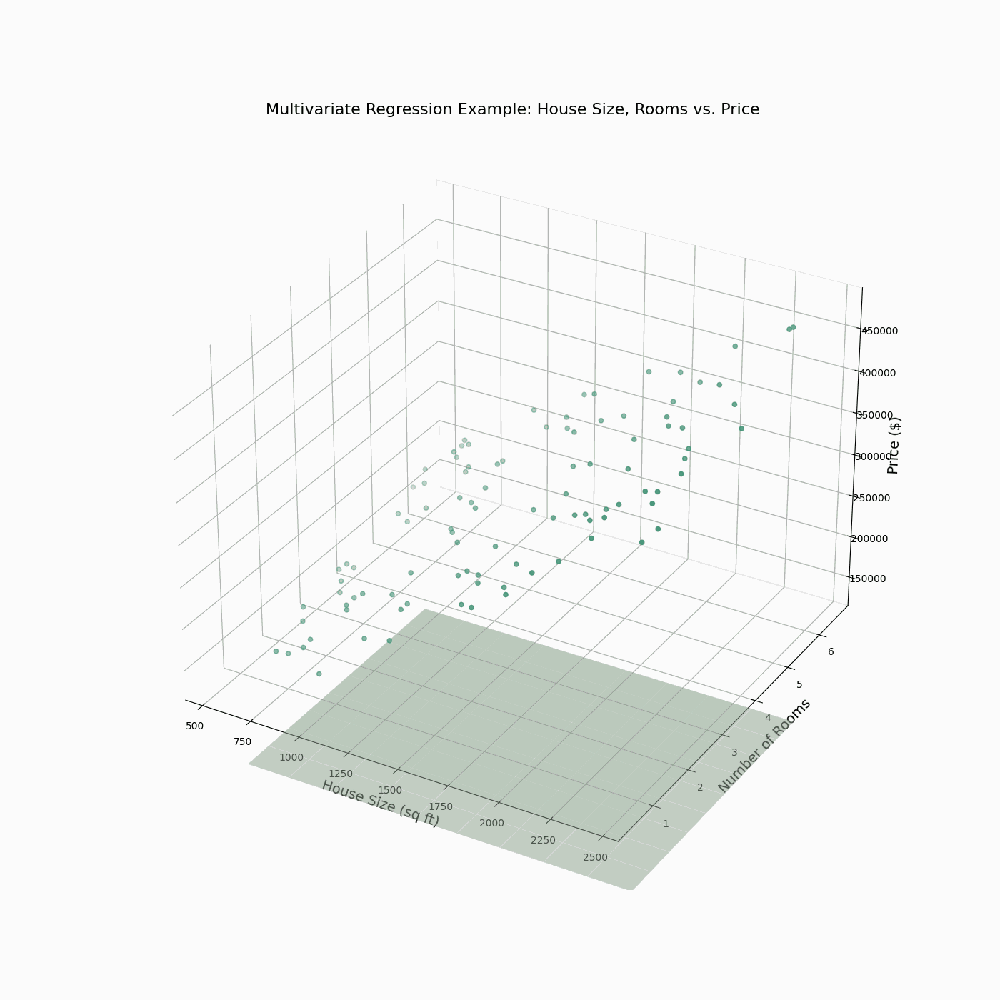

# Oriëntatie op Artificial Intelligence 2024-2025

De cursus OAI bevat een aantal verschillende onderdelen, waarmee je analytische 
skills leert die heel waardevol zijn voor een IT'er. 

Daarnaast is het natuurlijk ook heel leuk om meer te leren over Artificial Intelligence als 
veld (en studierichting 😊), dus heb ik ook wat van [mijn favoriete bronnen](#linas-ai-bronnen) over AI bijgevoegd.

Cursusinhoud:

- [Deel 1: Getallen](#getallen)
- [Deel 2: Algoritmiek](#algoritmiek)
- [Deel 3: Statistiek](#statistiek)

## Getallen

Lessen:

- [OAI1 - Wiskundige bewerkingen](OAI1/OAI1.py)
- [OAI2 - Logaritmen en rijen](OAI2/OAI2.py)

Extra:

- [Oefenen met set-logica op KhanAcademy](https://www.khanacademy.org/math/statistics-probability/probability-library/basic-set-ops/e/basic_set_notation)

## Algoritmiek

Lessen:

- [OAI - Zoeken](OAI3/OAI3.py)
- [OAI - Sorteren](OAI4/OAI4.py)
- [OAI - Recursie](OAI5/OAI5.py)
- [OAI - Lineaire Regressie](OAI6/OAI6.py)

Bronnen:

- [Oefenen met algoritmes op KhanAcademy (inclusief zoekalgoritmes)](https://www.khanacademy.org/computing/computer-science/algorithms)
- [Video: Sorteeralgoritmes gevisualiseerd](https://www.youtube.com/watch?v=kPRA0W1kECg)

## Statistiek

Lessen:

- [OAI - Inleiding statistiek en centrummaten](OAI7/OAI7.py)
- [OAI - Spreiding en normaalverdeling](OAI8/OAI8.py)

Bronnen:

- [Oefenen op KhanAcademy](https://www.khanacademy.org/math/statistics-probability)

Extra:

- [Oefenen op KhanAcademy met distributie van data](https://www.khanacademy.org/math/statistics-probability/modeling-distributions-of-data),
Machine Learing is een van de belangrijkste tools voor AI. Om de algoritmes effectief in te kunnen zetten, 
moeten we eigenlijk altijd weten hoe onze data verdeeld is en hoe dit eruit ziet.

## Lina's AI bronnen

### Repositories & Code

- In [deze repository](https://github.com/SelinaBlijleven/AI-tools-learning) 
werk ik aan cursusmaterialen voor AI. Momenteel kun je hier vooral visualisaties vinden van Machine Learning algoritmes (en de 
achterliggende voorbeelden uiteraard 👌)
- [Speel zelf met een neural netwerk](https://playground.tensorflow.org/)

### Video

- [CodeBullet: veel video's AI in games en voor de lol](https://www.youtube.com/@CodeBullet)
- [AI's spelen verstoppertje (OpenAI, reinforcement learning)](https://www.youtube.com/watch?v=Lu56xVlZ40M)
- [AI leert om te lopen (reinforcement learning)](https://www.youtube.com/watch?v=L_4BPjLBF4E)

